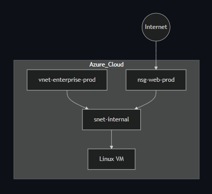

# Azure Enterprise-Grade Infrastructure with Terraform 2026

## Strategic Objective
Built as part of my Terraform Associate preparation, this project simulates a real-world enterprise Azure environment.

It demonstrates the design and implementation of production-ready infrastructure using Terraform, with a focus on Zero Trust security and solving practical deployment challenges such as regional capacity constraints and SKU optimization.

## 1. Infrastructure Components (Fully Implemented)
The environment is successfully deployed and verified in the **Southeast Asia (Singapore)** region, ensuring robust resource availability and low latency.

1. **Management Layer**: **[Completed]** Automated Resource Group creation (`rg-enterprise-prod`) for logical isolation and lifecycle management.
2. **Network Layer**: **[Completed]** VNet and Subnet design incorporating **Standard SKU Public IP** for enterprise-grade reliability and security features.
3. **Security Layer**: **[Completed]** Strict **Network Security Groups (NSG)** enforcing a Zero Trust model. Inbound traffic is restricted to SSH (Port 22) using **SSH Key-based Authentication**.
4. **Compute Layer**: **[Completed]** Hardened **Ubuntu 22.04 LTS** instance using **Standard_D2s_v3**, optimized for performance and stability in enterprise workloads.
5. **Monitoring Layer**: [Completed] Integrated Azure Monitor with Metric Alerts to track CPU usage. Configured an Action Group for automated email notifications.
6. **State Management**: [Completed] Secured infrastructure lifecycle using a Remote Backend (Azure Blob Storage) with state locking to prevent concurrency issues.

## Architectural Excellence (AZ-305 & AZ-500 Principles)
- **Resilient Infrastructure**: Successfully navigated regional capacity limits by strategically migrating deployment from Australia East to **Southeast Asia**, showcasing adaptive cloud resource management.
- **Zero Trust Networking**: Implemented strict NSGs to enforce the principle of least privilege, ensuring "Security by Design."
- **Enterprise Standards**: Utilized **Standard SKU IPs** and **SSH Key Auth**, aligning with the Azure Security Benchmark and professional compliance standards.
- **Modular & Scalable**: Decoupled resource definitions using Terraform for future-proof growth and maintainability.
- **Automated Observability**: Implemented "Monitoring as Code" to ensure every deployed resource is immediately under surveillance, aligning with enterprise operational standards.
- **State Security & Consistency**: Migrated from local to remote state management, ensuring a "Single Source of Truth" and enabling safe collaboration within a team environment.

## Enterprise Architecture Diagram

*(Architecture includes: VNet, Subnet, NSG, Standard Public IP, and D2s_v3 Virtual Machine)*

## Tech Stack
- **Cloud Provider**: Microsoft Azure
- **IaC Tool**: Terraform (HCL)
- **OS**: Ubuntu 22.04 LTS
- **Security Framework**: SSH Key-based (Passwordless)
- **Deployment**: Local execution with Azure CLI / Git-based workflow

## How to Deploy
1. **Initialize**: `.\terraform init`
2. **Validate**: `.\terraform plan`
3. **Deploy**: `.\terraform apply -auto-approve`
4. **Access**: `ssh -i ~/.ssh/id_rsa azureuser@<Public_IP>`

## Why This Project?

In many enterprise environments, infrastructure is still manually configured, leading to inconsistencies, security risks, and operational inefficiencies.

To address these challenges, I built this project using Terraform to:

- Automate infrastructure deployment for consistency and reproducibility
- Enforce security best practices based on Zero Trust principles
- Solve real-world cloud issues such as regional capacity constraints and SKU compatibility

This project represents my transition from support-level operations to cloud engineering, with a focus on automation, security, and scalable architecture.

It demonstrates how modern enterprise cloud environments should be built: secure, consistent, and fully reproducible using Infrastructure as Code.

This project showcases a practical implementation of secure and scalable Azure infrastructure using Terraform.

### What Problem Does This Solve?
Manual infrastructure provisioning is error-prone, time-consuming, and difficult to scale. 
This project solves these challenges by:
- **Automating** deployment to ensure consistency across environments.
- **Enforcing** security best practices from the start (Security by Design).
- **Providing** a clear, reusable blueprint for enterprise-level cloud adoption.

### Update (2026-03-29):

- **Automated Provisioning**: Integrated user_data to automate Nginx installation on Ubuntu 22.04 LTS.

- **Security**: Verified HTTP (Port 80) access via NSG rules, maintaining a Zero Trust approach for SSH.

- **Deployment Method**: Successfully performed "Destroy and Recreate" (Immutable Infrastructure) using terraform apply -replace.

### Update (2026-04-03):

- **Full Observability**: Deployed
  azurerm_monitor_metric_alert to trigger alerts at 80% CPU utilization.

- **Advanced Dependency Management**: Resolved resource race conditions during parallel deployment by implementing explicit depends_on blocks for monitoring resources.

- **Enterprise State Locking**: Successfully migrated to Azure Storage Backend, ensuring robust state management.

---
**Contact**: Based in Malaysia and open to Cloud Engineer opportunities, including roles in Australia with visa sponsorship. Experienced in building secure and scalable cloud environments using IaC.

Key Skills Demonstrated:
- Infrastructure as Code (Terraform)
- Azure Networking (VNet, Subnet, NSG)
- Cloud Security (Zero Trust, SSH restriction)
- Troubleshooting (Region/SKU issues)
- Git-based workflow
