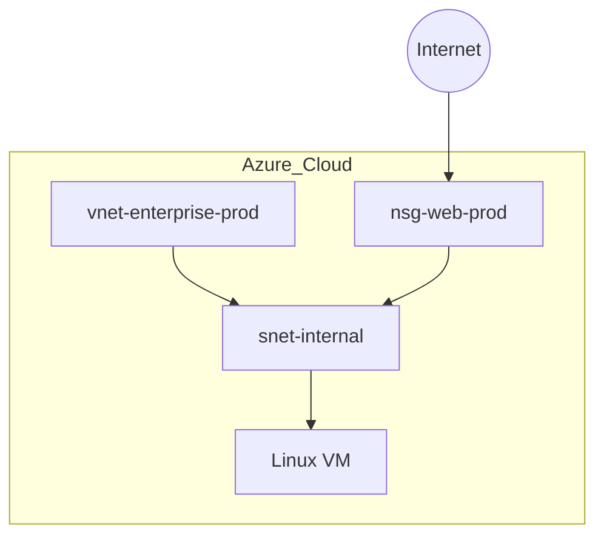

# Azure Enterprise-Grade Infrastructure with Terraform

## Strategic Objective
This repository demonstrates a **Production-Ready** cloud infrastructure deployment on Microsoft Azure using Terraform. 
As an Azure specialist with 10 years of experience and **AZ-305/AZ-500** principles, I designed this project to showcase best practices in Infrastructure as Code (IaC), focusing on **Security, Scalability, and Automation.**

## Infrastructure Components (Step-by-Step Evolution)
Current deployment state:
1. **Management Layer**: **[Completed]** Automated Resource Group creation for logical isolation.
2. **Network Layer**: **[Completed]** VNet and Subnet design with strict NSG rules to enforce Zero Trust.
3. **Compute Layer**: (Planned) Hardened Linux VM deployment for secure application hosting.

## Architectural Excellence (AZ-305 & AZ-500 Principles)
- **Zero Trust Networking**: Implementing strict Network Security Groups (NSG) to enforce the principle of least privilege (Port 22 restricted).
- **Modular & Scalable**: Decoupled resource definitions using Terraform for future-proof growth.
- **Resource Governance**: Automated resource management in Australia East region to optimize compliance and visibility.

### # Architecture Diagram

## Infrastructure Diagram

## 🛠 Tech Stack
- **Cloud Provider**: Microsoft Azure
- **IaC Tool**: Terraform (HCL)
- **Security Framework**: Azure Security Benchmark
- **Deployment**: Local execution with Azure CLI / Git-based workflow

## How to Deploy
1. **Login**: `az login`
2. **Initialize**: `terraform init`
3. **Validate**: `terraform plan`
4. **Deploy**: `terraform apply -auto-approve`

## Why This Project?
### What Problem Does This Solve?
Manual infrastructure provisioning is error-prone, time-consuming, and difficult to scale. 
This project solves these challenges by:
- **Automating** deployment to ensure consistency across environments.
- **Enforcing** security best practices from the start (Security by Design).
- **Providing** a clear, reusable blueprint for enterprise-level cloud adoption.

---
**Contact**: Currently based in Malaysia, actively seeking Cloud Engineer opportunities in Australia with Visa Sponsorship. 
I bring a proven track record of reducing cloud costs and security risks through automated IaC workflows.
